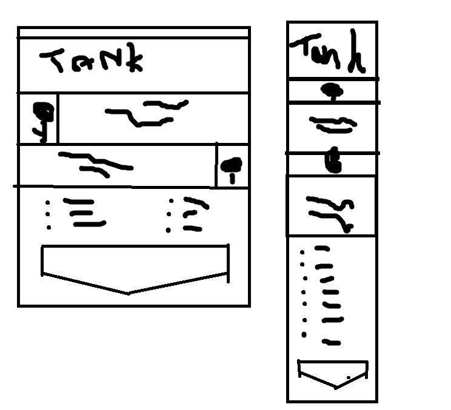

# Tanking Fundamentals – A Beginner’s Guide

## Project Overview
This project is a one-page educational website designed to clearly explain the fundamentals of **Tanking** in team-based games. The site mirrors the structure and purpose of a safeguarding information site by focusing on **protection, responsibility, awareness, and correct response** within a team environment.

Just as safeguarding is about protecting vulnerable people, **Tanking is about protecting teammates**, controlling threats, and creating a safe environment for the rest of the team to succeed.

The website is built using **HTML, CSS, and Bootstrap**, and follows accessibility, user experience, and responsive design principles.

---

## User Goal
The user seeks **clear, easy-to-understand information** on:
- What a Tank is
- The responsibilities of the Tank role
- How to recognise poor positioning or loss of enemy control
- What actions to take to protect the team effectively

The content is structured for **beginners**, using simple language and clear visual hierarchy.

---

## Site Owner Goal
The site owner aims to deliver **a straightforward, structured, and intuitive one-page web application** that:
- Explains Tanking using clear, educational content
- Is responsive across all screen sizes
- Uses semantic HTML and accessible design
- Helps users quickly find and understand key information

---

## Key Features
- **Hero Section:** Introduces the importance of the Tank role as the front-line protector
- **What Is a Tank?:** Explains the role in clear, simple terms
- **Core Responsibilities:** Outlines the Tank’s duty to control enemies and protect allies
- **Action Steps:** Bullet-pointed guidance on how to react during combat
- **Contact / Resources:** A simple section for feedback or learning resources

---

## Technologies Used
- HTML5  
- CSS3  
- Bootstrap 5  
- Git & GitHub  

---

## Accessibility & UX
- Semantic HTML structure
- Clear navigation
- Readable font sizes and spacing
- High contrast colour choices
- Fully responsive layout using Bootstrap’s grid system
- All images include appropriate `alt` text

---

## Validation & Testing
- HTML validated using **W3C Validator**
- CSS validated using **Jigsaw Validator**
- Responsive testing carried out using Chrome DevTools
- Navigation and internal links tested for full functionality

---

## Deployment
This project is deployed using:
- **GitHub** for version control
- **GitHub Pages** (or Netlify) for cloud hosting

### Deployment Steps:
1. Clone the repository
2. Open the project locally
3. Push final version to GitHub
4. Deploy using GitHub Pages

The deployed version matches the development version with no functional differences.

---

## Screenshots

- Hero section introducing Tanking as a protective role  
- Information sections explaining responsibilities  
- Action steps section with beginner guidance  

Each screenshot demonstrates how the site delivers **clear, structured, and accessible learning content.**

---

## Use of AI in Development (LO5)

---
## Planning/Wireframe

---

## Author
Student Name: *Dean Harland*  
Course: AI Augmented Full Stack Bootcamp  
Project: HTML/CSS/Bootstrap Individual Project  

---

## License
This project is for educational purposes only.
